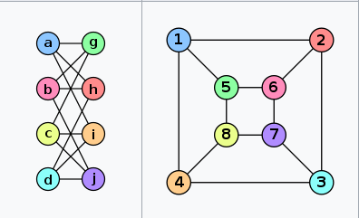
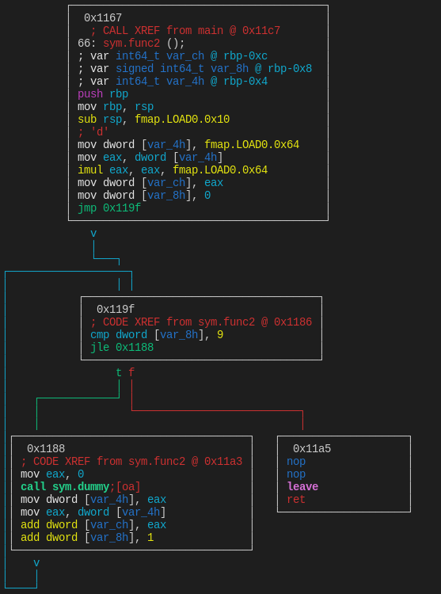
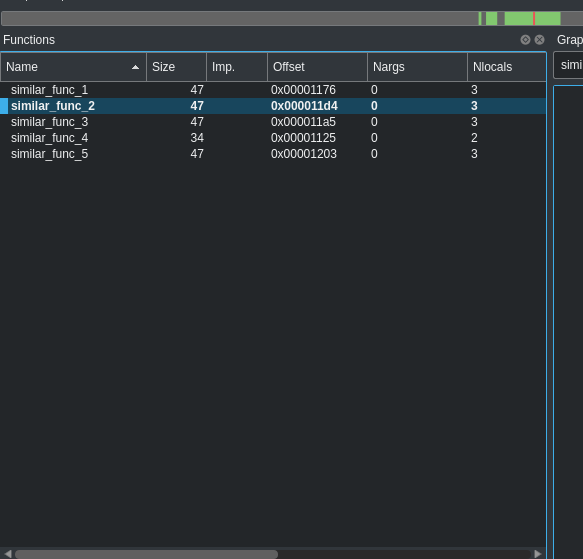

# eqfunc

Find structural equivalent functions inside binaries using [Graphs isomorphism](https://en.wikipedia.org/wiki/Graph_isomorphism).

## Wait, what ?

This is a Radare2/Rizin/Cutter script to model a basic block function graph into a real graph, using [networkx](https://networkx.org/documentation/stable/reference/algorithms/isomorphism.html), and then search inside the binary others functions that has the same ***structure***, this means that even if the function has differente code but equal structure it will be found!

### Why ?

Well, in my case I created that to solve a real world problem when I was analyzing a obfuscated software that used one function per string inside in order to decrypt them, instead to seek all the functions I decided to pick one as example and search all structural equal functions, this helped me to decipher everything by emulating all the similar functions. I ended with a tiny and useful binary analysis tool that can help a lot of people to solve this kind of problem, that's why.

### Isomorphism

In graph theory, isomorphism happens when a graph has a different representation but have a equivalent relation. 

||
|:--:|
|Two graphs that are equal in their structure|

This can be checked by either validanting the number of edges in each node or by using some algorithm like ***VF2***, that is the default algorithm in isomorphism check in [networkx](https://networkx.org/documentation/stable/reference/algorithms/isomorphism.html)

### Example

Consider this functions:

```c
void func() {
	int x = 100;
	for (int i = 0; i < 100;i++) {
		puts("Hi!");
	}
}


void func2() {
	int x = 65;
	int y = x * 100;
	for (int j = 0; j < 10; j++) {
		x = dummy();	
		y += x;
	}
}

int dummy() 
{
	return 1;
}
```

We know that ***func*** is different than ***func2*** but they share the same code structure, has a variable declaration block and a for loop block, using ***radare2*** we can easily peek inside their structures:

|||
|:--:|:--:|
|Func code block graph|Func2 code block graph|

So, based in ***func*** we can find ***func2***!

<pre>
$ ./eqfunc.py examples/binteste sym.func                                              
Found 1 functions with the same structure as sym.func: 
       - 0x1167
</pre>

When using as standalone it will show a list of functions address that it found.

# Installing

This script was built on top of [r2pipe](https://github.com/radareorg/radare2-r2pipe), a radare2 script interface, so in order to run this as a standalone tool you will need to install [radare2](https://github.com/radareorg/radare2) or [rizin](https://github.com/rizinorg/rizin), then install the python dependencies:

> pip install requirements.txt --user

You now are ready to go.

## Using

To keep this simple as possible, there is no fancy command line args.

### Standlone
./eqfunc.py binary_path function_adress

### Inside radare2 or rizin

>#!pipe python eqfunc.py address newname

Inside R2 or Rizin it will also rename the similars functions with the ***newname*** argument and concat with ***_similar_count***, you can check by listing your functions:

```
[0x00001135]> fs functions ;f ~similar
0x00001167 66 similar_func_1
```

### Inside Cutter

As this also support rizin, you can easily call that from [cutter](https://cutter.re) by using the same command above and then going to ***View > Refresh Contents*** to apply the new functions name to Cutter UI:

||
|:--:|
|Cutter function list widget|


### Scripting

You can also import this file for scripting, there one function called ***find_equals*** to be used for this purposes:


```python
import r2pipe
import eqfunc

r2 = r2pipe.open('examples/binteste')
maybe_equal_fcns = eqfunc.find_equals('0x1167', r2, False) # set to True if you are using rzpipe
print(maybe_equals_fcns)
# ['0x1135']
```


# Conclusion


That's it, I want to port that to IDA very soon so stay tuned in this repo for future updates, any problems or doubts feel free to open a issue! thanks.


